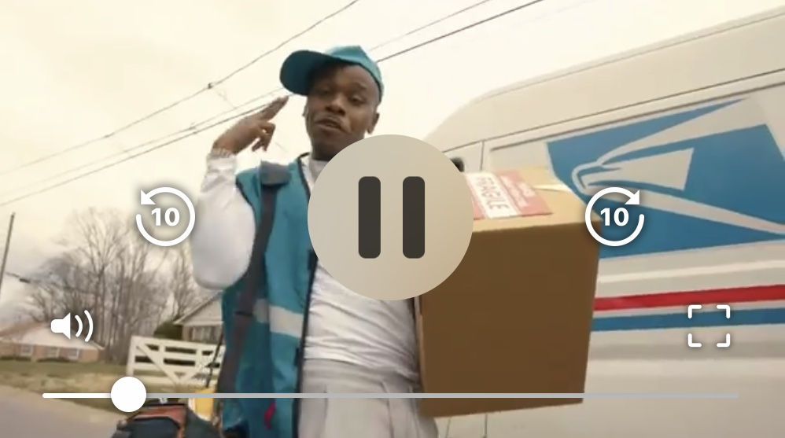
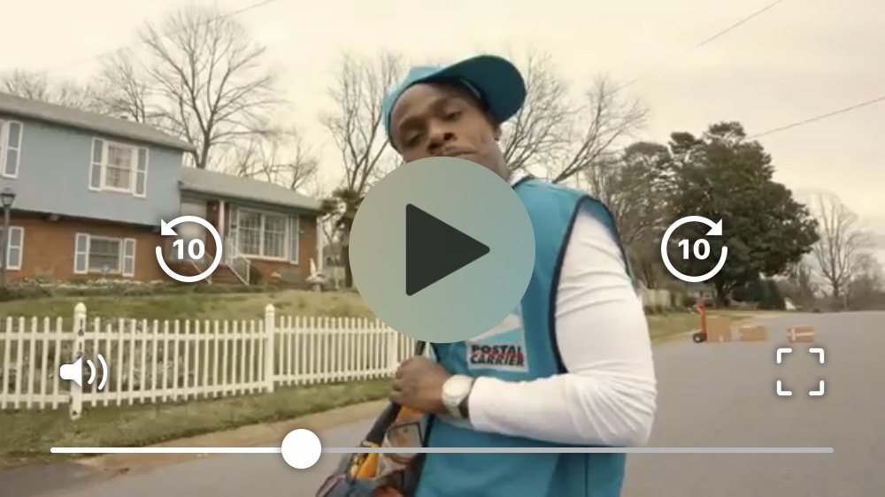

# NSPRTVideoPlayer
 
[](https://github.com/nsprt/NSPRTVideoPlayer)


A beautiful video player created for use with SPM.

Playing         |  Paused
:-------------------------:|:-------------------------:
  |  

## Requirements

- iOS 12.0+

## Installation

### Xcode Projects

Using Xcode, select `File` -> `Swift Packages` -> `Add Package Dependency` and enter https://github.com/NSPRT/NSPRTVideoPlayer.

### Install via the Swift Package Manager

Add the following to your Package.swift
```swift
    .Package(url: "https://github.com/nsprt/NSPRTVideoPlayer.git", majorVersion: 1)
```

Then simply `import NSPRTVideoPlayer` wherever you’d like to use it.

## Getting Started

Create an instance of `NSPRTVideoPlayerView` with an initial `CGRect`, initialize a `NSPRTPlayerItem` with your video URL, and set the item in the `NSPRTVideoPlayerView`:
```swift
let playerView = NSPRTVideoPlayerView(frame: CGRect(x: 0, y: 0, width: self.bounds.width, height: self.bounds.width * (9/16)))
let item = NSPRTPlayerItem(url: url)
playerView?.set(item: item)
```

Create an instance of `NSPRTVideoPlayerControls` and pass that to our `NSPRTVideoPlayerView` with the `use(controls: NSPRTVideoPlayerControls)` function:
```swift
let controls = NSPRTVideoPlayerControls()
playerView.use(controls: controls)
```

## Adding to View
The best way to add our player view is to have it nested in a subview, that way if a user enters full screen and exits fullscreen `NSPRTVideoPlayerView` automatically resizes back to its original placement:
```swift
let subView = UIView()
self.addSubview(subView)
subView.translatesAutoresizingMaskIntoConstraints = false
NSLayoutConstraint.activate([
    subView.topAnchor.constraint(equalTo: topAnchor),
    subView.widthAnchor.constraint(equalTo: widthAnchor),
    subView.heightAnchor.constraint(equalToConstant: bounds.width * (9/16)), // 16:9 Aspect Ratio
    subView.centerXAnchor.constraint(equalTo: centerXAnchor)
    ])
    
subView.addSubview(playerView)
playerView.translatesAutoresizingMaskIntoConstraints = false
NSLayoutConstraint.activate([
    playerView.topAnchor.constraint(equalTo: subView.topAnchor),
    playerView.rightAnchor.constraint(equalTo: subView.rightAnchor),
    playerView.bottomAnchor.constraint(equalTo: subView.bottomAnchor),
    playerView.leftAnchor.constraint(equalTo: subView.leftAnchor)
    ])
```

## Creator
Chaz Woodall - chazwoodall@gmail.com

## License
NSPRTVideoPlayer is available under the MIT license. 
